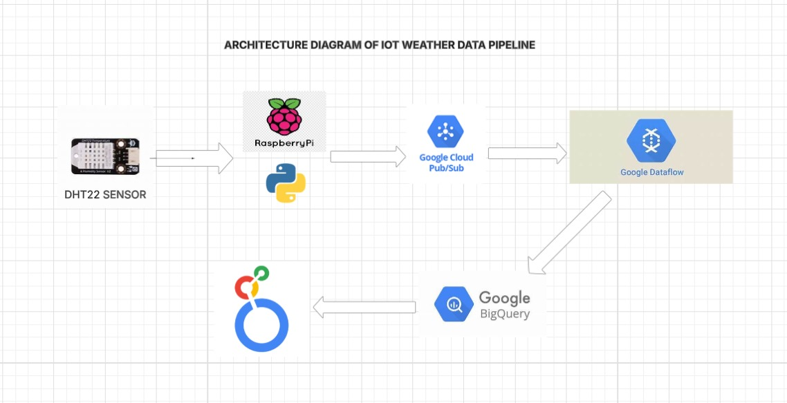

# IoT-Weather-Data-Pipeline-GCP

## INTRODUCTION
This project demonstrates a real-time IoT data pipeline built using Google Cloud Platform (GCP) and a Raspberry Pi device equipped with a DHT22 sensor. It captures live temperature and humidity data from the environment and streams it to Google Cloud Pub/Sub. From there, the data is processed using Apache Beam running on Google Cloud Dataflow and stored in BigQuery for analysis. Finally, the weather metrics are visualized through an interactive dashboard using Looker Studio, offering real-time insights into local environmental conditions. This project showcases a complete end-to-end data engineering solution combining hardware, real-time cloud processing, and effective visualization — all within the GCP free tier.

## ARCHITECTURE

## TECHNOLOGIES USED
1.💻 Programming & Scripting
  - Python (For reading sensor data, publishing to Pub/Sub, and creating the Dataflow pipeline)
  - SQL (For querying data in BigQuery)

2.🧠 Hardware
  - Raspberry Pi (recommended: 3B+ or 4)
  - DHT22 Sensor – For measuring temperature and humidity

3.☁️ Google Cloud Platform (GCP)
   - Cloud Pub/Sub – For real-time message ingestion from IoT device
   - Cloud Dataflow (Apache Beam) – For real-time stream processing
   - BigQuery – For data warehousing and querying
   - Looker Studio – For building real-time interactive dashboards

4.⚙️ Other Tools
  - Google Cloud IAM – For service account permissions
  - Service Account Key (JSON) – For Raspberry Pi to authenticate with GCP
  - Pip & Virtualenv – For managing Python dependencies on Raspberry Pi

## DATA INPUT(USAGE AND GATHERING OF DATA VIA IOT)

This project generates its own real-time dataset using an IoT device (Raspberry Pi) connected to a DHT22 temperature and humidity sensor. The data is not sourced from any external dataset or API — instead, it's captured directly from the surrounding physical environment of the device.

🧾 Data Collection Process

1.Sensor Setup
  - The DHT22 sensor is wired to the GPIO pins of a Raspberry Pi. It continuously reads two key weather metrics:
   - Temperature (°C)
   - Humidity (%)

2.Data Publishing
  - A Python script running on the Raspberry Pi reads this data every few seconds and publishes it in real-time to a Google Cloud Pub/Sub topic in JSON format.

3.Stream Processing
  - The data is consumed by a Cloud Dataflow (Apache Beam) pipeline, which validates, formats, and streams it to a BigQuery table in real-time.

4.Dataset Storage
  - The dataset resides in a BigQuery table and continuously grows as new data points are collected.

5.Real-Time Visualization
  - Looker Studio connects directly to the BigQuery table and visualizes trends, current conditions, and historical data with charts, tables, and gauges.

## SCRIPTS FOR THIS PROJECT

1. Rasberry pi script  [weather_sensor_pub.py](https://github.com/THENNAVAN0605/Iot-Weather-Data-Pipeline-GCP/blob/main/weather_sensor_pub.py)
2. Data flow pipeline script  [data_flow_pipeline.py](https://github.com/THENNAVAN0605/Iot-Weather-Data-Pipeline-GCP/blob/main/data_flow_pipeline.py)
3. GCP SETUP SCRIPT  [gcp_setup.bash](https://github.com/THENNAVAN0605/Iot-Weather-Data-Pipeline-GCP/blob/main/gcp_setup.bash)
4. REQUIRED LIBRARIES  [Requiredlibraries.bash](https://github.com/THENNAVAN0605/Iot-Weather-Data-Pipeline-GCP/blob/main/Requiredlibraries.bash)
